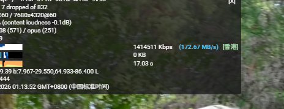

# YouTube 极速网速 + 真实 CDN 定位 (YouTube Speed & CDN Sniffer)

这是一个 Tampermonkey 油猴脚本，用于增强 YouTube 的"详细统计信息" (Stats for nerds) 面板。

## ✨ 主要功能

1.  **实时网速转换**: 将默认的 Kbps 实时转换为更直观的 **MB/s** 显示。
2.  **真实 CDN 物理定位**:
    * 不依赖简单的域名正则匹配（解决 YouTube 域名混淆问题）。
    * 通过 **DoH (DNS over HTTPS)** 解析视频流服务器的真实 IP。
    * 通过 **GeoIP** 查询 IP 归属地，精准显示节点位置（如：🇭🇰 香港、🇸🇬 新加坡、🇺🇸 美国等）。

## 📸 效果预览

## 📦 安装方法

1.  安装 [Tampermonkey](https://www.tampermonkey.net/) 插件。
2.  [点击这里安装脚本](https://raw.githubusercontent.com/EmersonLopez2005/YouTube-Speed-CDN/main/YouTube-Speed-CDN.user.js) (将文件上传到GitHub后点击Raw按钮获取链接)。

## ⚠️ 权限说明

脚本需要跨域访问以下服务以实现功能，安装时请点击 **"总是允许" (Always Allow)**：

* `dns.google`: 用于解析 `googlevideo.com` 域名的真实 IP。
* `ipwho.is`: 用于查询 IP 的地理位置（免费接口，无隐私风险）。

## 🛠️ 技术原理

* **Hook**: 拦截 YouTube 的 XHR/Fetch 请求以获取视频流域名。
* **DoH**: 使用 Google DNS API 绕过本地 DNS 污染/缓存，获取准确 IP。
* **Cache**: 内置 24 小时 GeoIP 缓存，避免频繁请求导致接口受限。

## 📄 License

MIT License
